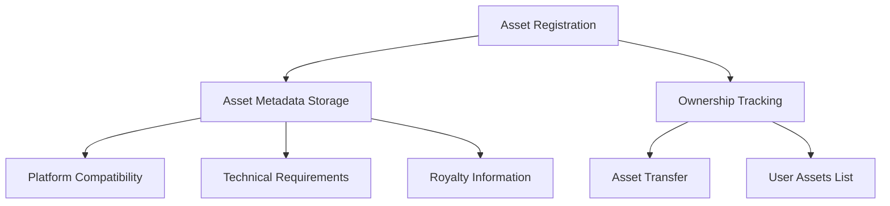

# Stacks VR Asset Registry

A decentralized registry for managing and trading virtual reality assets on the Stacks blockchain. This system enables secure ownership, transfer, and authentication of 3D models, environments, avatars, and other VR digital assets.

## Overview

The Stacks VR Asset Registry provides a comprehensive solution for managing virtual reality assets on-chain, with features specifically designed for VR content creators and users. It implements a robust metadata standard that captures essential VR-specific attributes while ensuring secure ownership and transfer mechanisms.

### Key Features

- Standardized VR asset registration with comprehensive metadata
- Secure ownership tracking and transfer capabilities
- Royalty management system for creators
- Platform compatibility tracking
- Detailed technical requirements specification
- Asset authentication via file hashing

### Target Users

- VR content creators and artists
- Virtual world developers
- VR platform operators
- Digital asset collectors
- Metaverse participants

## Architecture

The registry is built around a core contract that manages asset registration, ownership, and metadata. The system uses multiple maps to efficiently track asset ownership, metadata, and user holdings.



## Contract Documentation

### VR Asset Registry Contract

The main contract implementing the VR asset registry functionality.

#### Core Maps
- `asset-metadata`: Stores detailed information about each VR asset
- `asset-ownership`: Tracks current owners of assets
- `asset-exists`: Quick lookup for asset existence
- `user-assets`: Maps users to their owned assets

#### Key Functions

**Asset Management**
- `register-asset`: Create a new VR asset entry
- `transfer-asset`: Transfer ownership of an asset
- `update-asset-metadata`: Modify asset metadata
- `update-royalty-percentage`: Adjust royalty settings

**Query Functions**
- `get-asset-metadata`: Retrieve asset details
- `get-asset-owner`: Look up current owner
- `get-user-assets`: List assets owned by a user
- `get-royalty-info`: Get royalty configuration

## Getting Started

### Prerequisites

- [Clarinet](https://github.com/hirosystems/clarinet)
- Stacks wallet for deployment
- Node.js environment for testing

### Installation

1. Clone the repository
2. Install dependencies:
```bash
clarinet install
```

### Basic Usage

```clarity
;; Register a new VR asset
(contract-call? .vr-asset-registry register-asset
    "Cool VR Model"
    "An awesome 3D model"
    {x: u100, y: u100, z: u100}
    "https://example.com/model.glb"
    0x0123...  ;; File hash
    (list "OculusQuest2" "MetaQuest3")
    {
        min-gpu: "NVIDIA GTX 1660",
        recommended-gpu: "NVIDIA RTX 3070",
        min-cpu: "Intel i5-9400f",
        other-requirements: "8GB RAM"
    }
    u250  ;; 2.5% royalty
    none)

;; Transfer an asset
(contract-call? .vr-asset-registry transfer-asset u1 'ST1PQHQKV0RJXZFY1DGX8MNSNYVE3VGZJSRTPGZGM)
```

## Function Reference

### Public Functions

```clarity
(register-asset (name (string-ascii 64)) 
                (description (string-utf8 256))
                (spatial-dimensions {x: uint, y: uint, z: uint})
                (file-url (string-ascii 256))
                (file-hash (buff 32))
                (platform-compatibility (list 10 (string-ascii 32)))
                (rendering-requirements {...})
                (royalty-percentage uint)
                (additional-metadata (optional (string-utf8 1024))))
                -> (response uint uint)

(transfer-asset (asset-id uint) (recipient principal))
                -> (response bool uint)

(update-asset-metadata (asset-id uint) ...) 
                -> (response bool uint)

(update-royalty-percentage (asset-id uint) (royalty-percentage uint))
                -> (response bool uint)
```

### Read-Only Functions

```clarity
(get-asset-metadata (asset-id uint))
                -> (optional {...})

(get-asset-owner (asset-id uint))
                -> (optional {owner: principal})

(get-user-assets (user principal))
                -> {asset-ids: (list 100 uint)}
```

## Development

### Testing

Run the test suite:
```bash
clarinet test
```

### Local Development

1. Start Clarinet console:
```bash
clarinet console
```

2. Deploy contracts:
```bash
clarinet deploy
```

## Security Considerations

### Limitations

- Maximum of 100 assets per user
- Royalty percentage capped at 10%
- File URLs must be ASCII compatible
- Platform compatibility limited to 10 platforms per asset

### Best Practices

1. Always verify asset existence before operations
2. Validate all input parameters
3. Check ownership before asset modifications
4. Keep file hashes for authenticity verification
5. Maintain accurate platform compatibility lists

### Important Notes

- All asset transfers are irreversible
- Metadata updates preserve immutable fields
- Only creators can modify royalty settings
- Asset IDs start from 1 and increment sequentially